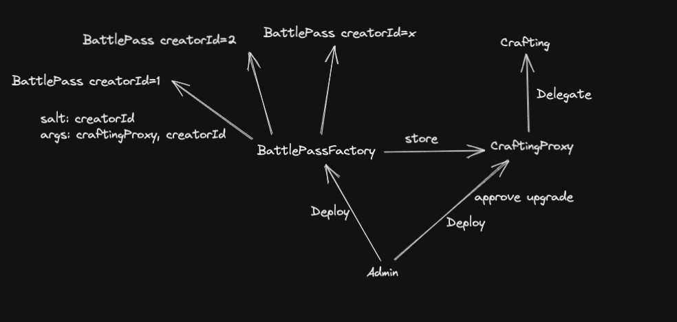

```
                  ,▄██▄▄                                                      ,╔╗╔╗╔╗,
                  ╫███████▄▄                                               ,╔╗╫╫╫╫╫╫╫╫
                  ╫╫╫░░███████▄▄                                        ,╔╗╫╫╫╫╫╫╫╫╫╫╫
                  ╫╫╫╫╫╫╫░░███████▄▄                                 ,╔╗╫╫╫╫╫╫╫╫╫╫╫╫╫╫
                  *╫╫╫╫╫╫╫╫╫╫░░███████▄▄                          ,╔╗╫╫╫╫╫╫╫╫╫╫╫╫╫╫╫╫╛
                   ╟╫╫╫╫╫╫╫╫╫╫╫╫╫░░███████▄▄▄                  ,╔╗╫╫╫╫╫╫╫╫╫╫╫╫╫╫╫╫╫╫╛
                   *╫╫╫╫╫╫╫╫╫╫╫╫╫╫╫╫╫░░████████▄▄▄          ,╔╗╫╫╫╫╫╫╫╫╫╫╫╫╫╫╫╫╫╫╫╫╫
                    ╟╫╫╫╫╫╫╫╫╫╫╫╫╫╫╫╫╫╫╫╫░░█████████▄▄▄▄ ,╔╗╫╫╫╫╫╫╫╫╫╫╫╫╫╫╫╫╫╫╫╫╫╫╫╛
                    *╫╫╫╫╫╫╫╫╫╫╫╫╫╫╫╫╫╫╫╫╫╫╫╫░░████████╫╫╫╫╫╫╫╫╫╫╫╫╫╫╫╫╫╫╫╫╫╫╫╫╫╫╫╛
                     ╫╫╫╫╫╫╫╫╫╫╫╫╫╫╫╫╫╫╫╫╫╫╫╫╫╫╫╫██░╫╫╫╫╫╫╫╫╫╫╫╫╫╫╫╫╫╫╫╫╫╫╫╫╫╫╫╫╫╛
                     *╫╫╫╫╫╫╫╫╫╫╫╫╫╫╫╫╫╫╫╫╫╫╫╫╫╫╫░░╫╫╫╫╫╫╫╫╫╫╫╫╫╫╫╫╫╫╫╫╫╫╫╫╫╫╫╫╫╫
                      ╫╫╫╫╫╫╫╫╫╫╫╫╫╫╫╫╫╫╫╫╫╫╫╫╫╫░╫╫╫╫╫╫╫╫╫╫╫╫╫╫╫╫╫╫╫╫╫╫╫╫╫╫╫╫╫╫╫╛
                      ╫╫╫╫╫╫╫╫╫╫╫╫╫╫╫╫╫╫╫╫╫╫╫╫░░╫╫╫╫╫╫╫╫╫╫╫╫╫╫╫╫╫╫╫╫╫╫╫╫╫╫╫╫╫╫╫╫
                      *╫╫╫╫╫╫╫╫╫╫╫╫╫╫╫╫╫╫╫╫╫╫░╫╫╫╫╫╫╫╫╫╫╫╫╫╫╫╫╫╫╫╫╫╫╫╫╫╫╫╫╫╫╫╫╫╛
                       ╫╫╫╫╫╫╫╫╫╫╫╫╫╫╫╫╫╫╫╫░░╫╫╫╫╫╫╫╫╫╫╫╫╫╫╫╫╫╫╫╫╫╫╫╫╫╫╫╫╫╫╫╫╫╫
                       *╫╫╫╫╫╫╫╫╫╫╫╫╫╫╫╫╫╫╫██░╫╫╫╫╫╫╫╫╫╫╫╫╫╫╫╫╫╫╫╫╫╫╫╫╫╫╫╫╫╫╫╫╛
                        ╫╫╫╫╫╫╫╫╫╫╫╫╫╫╫███████░░╫╫╫╫╫╫╫╫╫╫╫╫╫╫╫╫╫╫╫╫╫╫╫╫╫╫╫╫╫╛
                        *╫╫╫╫╫╫╫╫╫╫╫████████████░╫╫╫╫╫╫╫╫╫╫╫╫╫╫╫╫╫╫╫╫╫╫╫╫╫╫╫╫
                         ╫╫╫╫╫╫╫╫████████████████▀▀▀ └╫╫╫╫╫╫╫╫╫╫╫╫╫╫╫╫╫╫╫╫╫╫╛
                         *╫╫╫╫██████████████▀▀             └╣╫╫╫╫╫╫╫╫╫╫╫╫╫╫╫
                          ╫╫██████████▀▀                      └╫╫╫╫╫╫╫╫╫╫╫╫╛
                          *╫████▀▀                                 └╫╫╫╫╬╫╛
```

<div align="center">

# MATRIX EVM Contracts 🫡

</div>

<div align="center">

[](https://github.com/matrixesports/evm-contracts/actions/workflows/tests.yml)

</div>



## BattlePass

-   Each creator gets their own `BattlePass` contract, the crafting contract has mint/burn access on this contract.
-   Battle Pass rewards users for completing creator-specific quests during established periods known as `seasons`. Experience points or `xp` tracks user progression. Similar to the mechansim used in games.
-   The contract is responsible for storing level information, tracking user progress, and minting rewards upon level completion.
-   There can be multiple seasons in 1 BattlePass
-   Rewards can be of the following types:
    -   `PREMIUM_PASS`🎫: A user who owns a premium pass can claim premium rewards
    -   `CREATOR_TOKEN`🪙: Creator-specific token
    -   `LOOTBOX`🎁: As the name suggests,
    -   `REDEEMABLE`🤝: These require actions from the creators in real life or online, for ex: ship merch, follow back on twitter, etc.
    -   `SPECIAL`👀: Custom assets, such as one-of-one NFTs, in-game assets, etc.

## Crafting 🧑‍🍳.

-   One crafting contract is deployed on each network.
-   Allows users to `craft` new tokens based on a `recipe`
-   The recipe defines a list of input tokens, known as ingredients, and a list of output tokens. Crafting is then the act of burning the input tokens and minting the output tokens✨.
-   Crafting uses ONLY items from Battle Pass contracts and must be whitelisted by all BattlePass for minting rights.

### Instalation

```bash
make install
```

## Important

-   submodules:
    -   solmate, forge-std works fine with forge update
    -   need to keep an eye on oz, master branch is dev branch, works on release branches, current version installed is v4.6.0. https://github.com/foundry-rs/foundry/issues/401
-   We use oz's EIP-2771 implementation to enable gasless transactions for our users. We do not verify signatures right now because we use magic wallet on our front end and tx can be signed without users approval as it is, running a forwader that verifies tx would be a bit redundant for now.
-   We use a UUPS proxy to upgrade the crafting contract

### DEPLOYED ADDRESSES

#### MATIC:

```
Crafting: `0xA789fF4664FA63F81C4bd2597775D74512F92Dd8`
Crafting Proxy: `0x71Bc7af5d816dAe3061D6972AC8BCC92D71Ec4f0`
BattlePassFactory: `0x50c9a6c238eA2a2312562666e19Bfb79F8B0eca2`
```

## Acknowledgements

-   This project uses [Foundry](https://getfoundry.sh). See the [book](https://book.getfoundry.sh/getting-started/installation.html) for instructions on how to install and use Foundry.
-   Repo structure heavily inspired by [solmate](https://github.com/Rari-Capital/solmate), [femplate](https://github.com/abigger87/femplate), [foundry](https://github.com/foundry-rs/forge-template)
